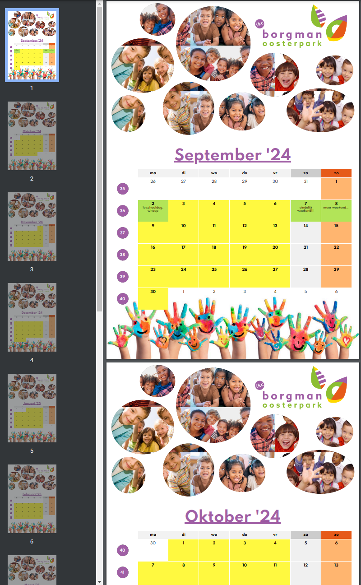
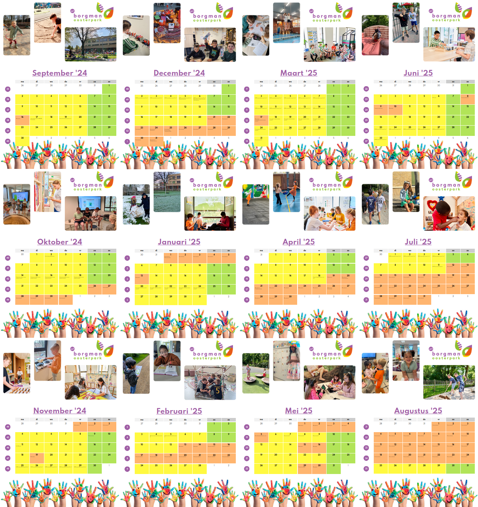

Borgmanschool Kalender in A3
============================

HTML/CSS-based calendar generator using Javascript. Use a web browser to
print the generated web page as PDF. Submit the PDF to an online print
service.

Configuration is done in ``THE_DOCUMENT.html``:

.. code-block:: javascript

    const cal = new MonthCalendarBuilder('2024-09-01');

    cal.addOffDay('2024-09-16', 'Margedag');
    cal.addRemark('2024-09-17', 'Informatiemomenten MB/MM');
    cal.addRemark('2024-09-17', 'Prinsjesdag');
    cal.addRemark('2024-09-19', 'Informatieavond groep 1 t/m 3');
    cal.addHoliday('2024-10-26', '2024-11-03', 'Herfstvakantie');
    // ...

    const calendarPages = 12; // one for each month
    for (let i = 0; i < calendarPages; ++i) {
      document.body.appendChild(cal.generateNextCalendarPage());
    }

Styles can be adjusted in ``style.css``. E.g. by adjusting these:

.. code-block:: css

    :root {
        /* usage: `color: var(--color1)` */
        --color1: #a05fa5; /* purple */
        --color1-bright: #e7a1eb;
        --color2: #8cbe32; /* green */
        --color2-bright: #b2e458;
        --color3: #ffd700; /* yellow */
        --color3-bright: #fff940;
        --color4: #e65a19; /* orange */
        --color4-bright: #ffb56f;
        --color5: #ccc; /* black */
        --color5-bright: #f0f0f0;
    }

Example output:

Final output for 2024/2025 kalender:

